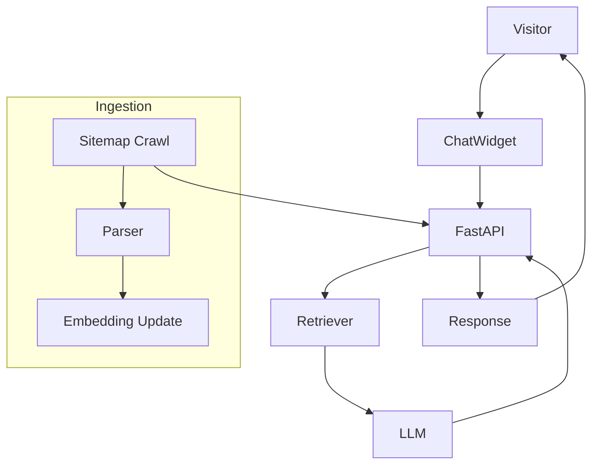

# Ginilytics AI‑Powered Website Chatbot – Solution Overview

---

## 🎯 What Is It?
The **Ginilytics Website Chatbot** is an intelligent, AI‑driven virtual assistant that lives on your website. It instantly answers visitor questions, showcases your portfolio, and guides prospects toward a conversion – all while maintaining a consistent, brand‑aligned voice.

---

## ✨ Core Benefits for Your Business
| Benefit | Why It Matters |
|--------|----------------|
| **Instant Visitor Engagement** | Reduce bounce rates by providing real‑time answers 24/7. |
| **Lead Qualification** | Capture contact details and qualify leads before a human sales rep steps in. |
| **Scalable Support** | Handle unlimited simultaneous conversations without adding staff. |
| **Brand Consistency** | Customizable prompts ensure every reply reflects your tone and messaging. |
| **Data‑Driven Insights** | Analytics on visitor intent, most‑asked questions, and conversion paths. |
| **Quick ROI** | Faster sales cycles and higher conversion rates yield measurable revenue uplift. |

---

## 🚀 Key Features
- **Retrieval‑Augmented Generation** – Leverages your website’s content (sitemap, FAQs, blog posts) to provide accurate, up‑to‑date answers.
- **FastAPI Backend** – High‑performance, secure, and easy to integrate with any front‑end.
- **Vector‑Store Knowledge Base** – Fast semantic search across all indexed pages.
- **Customizable Welcome Message & Call‑to‑Action** – Align the chatbot’s first impression with current promotions.
- **Weekly Automated Knowledge Ingestion** – Keeps the bot’s knowledge fresh without manual effort.
- **Rate Limiting & Security** – Protects against abuse and ensures data privacy.
- **Containerised Deployment** – One‑click Docker image or Kubernetes helm chart for cloud‑native environments.
- **Analytics Dashboard (optional)** – Real‑time metrics on usage, sentiment, and conversion.

---

## 📈 Business Impact (Sample Metrics)
| Metric | Typical Improvement |
|--------|----------------------|
| **Conversion Rate** | +15‑30% (by engaging visitors instantly) |
| **Average Response Time** | < 2 seconds (AI vs. human latency) |
| **Support Cost Savings** | 40‑60% reduction in routine query handling |
| **Lead Capture Rate** | +20% increase through proactive prompts |

---

## 🛠️ Deployment Options
| Option | Description |
|--------|-------------|
| **Self‑Hosted** | Deploy on your own servers or private cloud – full control over data. |
| **Managed Cloud** | Hosted on AWS / GCP with automatic scaling and backups. |
| **Hybrid** | Core inference runs in‑house; vector store hosted in a managed service (e.g., Pinecone). |

---

## 💰 Pricing Overview (Indicative)
| Tier | Monthly Cost | Included Features |
|------|---------------|-------------------|
| **Starter** | $299 | Up to 5,000 monthly sessions, basic analytics, self‑hosted Docker. |
| **Growth** | $799 | Up to 25,000 sessions, advanced analytics, weekly ingestion, priority support. |
| **Enterprise** | Custom | Unlimited sessions, dedicated SLA, custom branding, on‑prem deployment. |

*All tiers include a 14‑day free trial and unlimited training data ingestion.*

---

## 📦 How It Works – Simple 3‑Step Workflow
1. **Connect Your Site** – Provide the website URL or upload a sitemap. The bot indexes every page.
2. **Configure Brand Voice** – Supply a short style guide or sample dialogues; the AI aligns its replies.
3. **Deploy & Track** – Add a tiny JavaScript snippet to your site, watch live analytics, and iterate.

---

## 📚 Resources for Prospects
- **Live Demo** – Schedule a 30‑minute walkthrough (https://ginilytics.com/contact-us/).
- **Case Study** – See how a SaaS company lifted conversions by 28%.
- **Technical FAQ** – For IT teams evaluating security and compliance.
## ❓ Frequently Asked Questions

**Q1: How does the chatbot learn our content?**
The bot crawls your website’s sitemap weekly, extracts text, creates embeddings and stores them in a vector database.

**Q2: Is visitor data stored?**
Only the conversation transcript is temporarily kept for the session; no personal data is persisted unless you enable lead capture.

**Q3: What LLM is used?**
We integrate with OpenAI’s GPT‑4 (or compatible models) via a secure API key you provide.

**Q4: Can we customize the tone?**
Yes – upload a style guide or sample dialogues and the prompt‑engineer aligns responses.

---

## 📞 Ready to Transform Your Website?
Contact our sales team today:
- **Email:** sales@ginilytics.com
- **Website:** https://ginilytics.com/contact-us

---

*Prepared on 2026‑05‑26. Tailor the details to match your specific offering and pricing model.*
